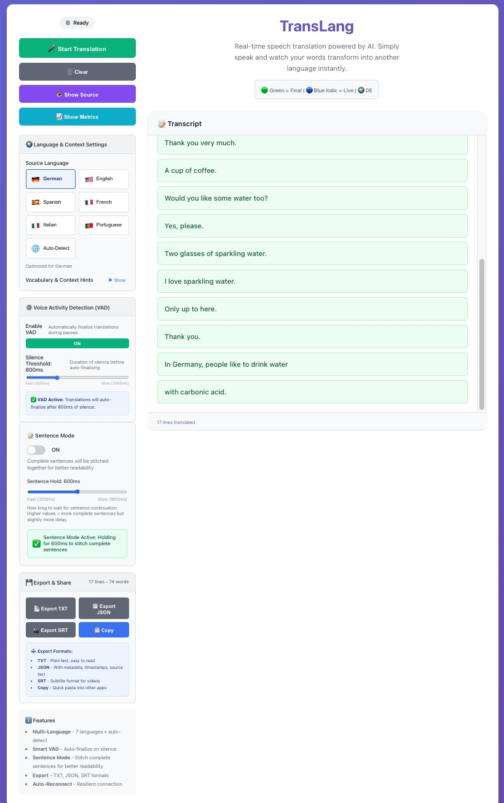

# TransLang - Real-Time Speech Translation

A production-ready web application for real-time speech translation powered by Soniox AI. Speak naturally and see instant translations with intelligent voice activity detection.

*TransLang's intuitive interface with multi-language support, voice activity detection, and real-time translation display*


## Features

- **Real-time Translation**: Spoken language to target language with sub-500ms latency
- **Natural Sentence Display**: Complete sentences instead of fragmented pieces (Phase 8)
- **Speaker Diarization**: Multi-speaker support with automatic speaker tracking and labeling (Phase 8)
- **Voice Activity Detection**: Automatic finalization during speech pauses
- **Intelligent Buffering**: Smart sentence boundary detection for natural reading experience
- **Live Updates**: Watch translations appear as you speak
- **Dual Display**: View both translated and original text with speaker labels
- **Smart Token Processing**: Clean transcripts with deduplication
- **Configurable Sensitivity**: Adjustable silence detection thresholds
- **Modern UI**: Large, readable text with auto-scroll and color coding


## Installation

### Prerequisites:
- Node.js 18 or higher
- Soniox API key ([sign up here](https://soniox.com))
- Modern browser with microphone support (Chrome, Firefox, Edge, Safari)

```bash
# Clone repository
git clone <your-repo-url>
cd translang-real_time_speech_to_translated_transcription_app

# Install dependencies
npm install

# Configure environment
cp .env.local.example .env.local
# Edit .env.local and add: SONIOX_SECRET_KEY=your_api_key_here

# Start development server
npm run dev

# Open http://localhost:3000
```

## Usage

1. **Grant microphone permission** when prompted by your browser
2. **Configure Voice Activity Detection** (optional):
   - Toggle VAD on/off
   - Adjust silence threshold: 300ms (fast) to 2000ms (slow)
   - Default: 800ms (recommended for natural speech)
3. **Configure Sentence Mode** (optional):
   - Toggle Sentence Mode on/off (default: OFF for fastest display)
   - Adjust sentence hold time: 300ms (fast) to 900ms (slow)
   - Default: 600ms (balances readability with speed)
4. **Start Translation** and speak in German
5. **View results**:
   - Green boxes: Final translations (confirmed)
   - Blue italic text: Live translations (updating)
   - Yellow boxes: Original German text (toggle to show/hide)
6. **Stop** to end session gracefully or **Cancel** for immediate termination

## Tech Stack

- **Framework**: Next.js 14 with App Router
- **Language**: TypeScript 5
- **UI**: React 18
- **Speech Recognition**: Soniox Speech-to-Text API
- **Voice Activity Detection**: @echogarden/fvad-wasm
- **Audio Processing**: Web Audio API, MediaStream

## Architecture

The application processes audio through parallel pipelines:

1. **Audio Capture**: Browser MediaStream API with optimized settings (16kHz, mono, noise suppression)
2. **Translation Stream**: Soniox WebSocket connection for real-time speech-to-text and translation
3. **Voice Activity Detection**: Parallel VAD processing for silence detection and auto-finalization
4. **Sentence Stitching**: Optional intelligent buffering to create complete sentences (configurable hold times)
5. **Token Processing**: Custom parser distinguishes between partial and final translation tokens
6. **UI Rendering**: React components with auto-scroll and color-coded display

## How it looks



## Available Scripts

| Command | Description |
|---------|-------------|
| `npm run dev` | Start development server |
| `npm run build` | Build for production |
| `npm run start` | Start production server |
| `npm run lint` | Run ESLint |

## Configuration

### Environment Variables

Create a `.env.local` file:

```env
SONIOX_SECRET_KEY=your_soniox_api_key_here
```

## Cloud Deployment (AWS)

TransLang can be deployed to AWS using Docker, ECR, and ECS Fargate. See the `deployment/` directory for complete guides:

- `deployment/QUICK-START.md` - Deploy in 30 minutes
- `deployment/AWS-DEPLOYMENT-GUIDE.md` - Comprehensive guide
- `deployment/AWS-ARCHITECTURE.md` - Infrastructure details
- `deployment/MONITORING.md` - Operations and monitoring

Estimated AWS cost: $11-33/month

## Performance

- **Latency**: 100-500ms end-to-end
- **Memory**: ~50-80MB including VAD
- **CPU**: Less than 10% average
- **Network**: Continuous WebSocket (low bandwidth)

## Security

- API keys stored server-side only
- Temporary keys generated for client use
- No sensitive data exposed to browser
- Secure WebSocket connections
- No conversation data persistence

## Browser Compatibility

| Browser | Support |
|---------|---------|
| Chrome | Recommended |
| Edge | Full support |
| Firefox | Full support |
| Safari | Supported |

Requires WebRTC, MediaStream API, and Web Audio API support.

### Audio Settings

Configured for optimal speech recognition:
- Sample rate: 16kHz
- Channels: Mono
- Echo cancellation: Enabled
- Noise suppression: Enabled
- Auto gain control: Enabled

## Project Structure

```
├── app/
│   ├── api/soniox-temp-key/    # Secure API key generation
│   ├── globals.css              # Styles and animations
│   ├── layout.tsx               # Root layout
│   └── page.tsx                 # Main page
├── components/
│   ├── TranscriptDisplay.tsx    # Translation display
│   ├── TranslatorControls.tsx   # Control panel
│   ├── VADSettings.tsx          # VAD configuration
│   └── SentenceSettings.tsx     # Sentence mode configuration
├── hooks/
│   └── useTranslator.ts         # Translation state management
├── utils/
│   ├── tokenParser.ts           # Token processing
│   ├── vadManager.ts            # VAD wrapper
│   ├── keepaliveManager.ts      # Connection keepalive
│   └── sentenceStitcher.ts      # Sentence stitching logic
├── types/
│   └── soniox.ts                # TypeScript definitions
└── deployment/                  # AWS deployment guides
```

## Troubleshooting

**Microphone not working**
- Check browser permissions in address bar
- Ensure microphone isn't used by another application
- Verify system microphone settings

**No translations appearing**
- Verify `SONIOX_SECRET_KEY` in `.env.local`
- Restart development server after environment changes
- Check browser console for errors
- Confirm API key is valid and active

**High latency**
- Check internet connection speed
- Close unnecessary browser tabs
- Disable browser extensions temporarily

**VAD not detecting pauses**
- Ensure VAD toggle is enabled
- Adjust silence threshold (try 800ms default)
- Speak clearly with natural pauses

## License

MIT License - see [LICENSE](LICENSE) file for details.

## Acknowledgments

- [Soniox](https://soniox.com/) for speech-to-text and translation API
- [@echogarden/fvad-wasm](https://www.npmjs.com/package/@echogarden/fvad-wasm) for voice activity detection
- [Next.js](https://nextjs.org/) and [TypeScript](https://www.typescriptlang.org/) communities


**TransLang** - Breaking language barriers in real-time
